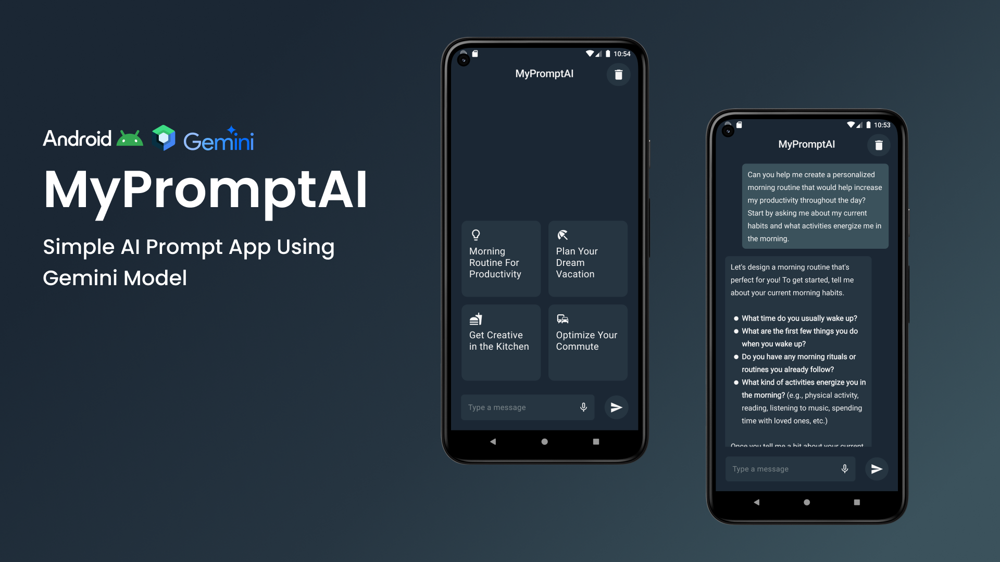

# <b>MY PROMPT AI</b>

<p>
My Prompt Ai is a mobile application that empowers users to leverage the power of Google's Gemini large language model for creative prompt generation.
</p>


## Installation

### Prerequisites

- Android Studio installed on your machine.
- Android SDK with API Level 27.

## Steps

1. Clone the repository:

   ```
   git clone https://github.com/MuhammadRadifa/my-prompt-ai-app

   cd cd mypromptaiapp
   ```

2. Open the project in Android Studio:

   - Open Android Studio.
   - Click on File -> Open.
   - Navigate to the mypromptaiapp directory and select it.

3. Configure SDK:

   - Ensure you have the Android SDK with API Level 27 installed.
   - You can install it via the SDK Manager in Android Studio (Tools -> SDK Manager).

4. Add local properties:

   - In the local.properties file (create it in the root project directory if it doesn't exist), add the following line:

   ```
   GEMINI_API_KEY=your_api_key
   ```

   note : [disclaimer](#disclaimer)

5. Build and run the project:

   - Click the Run button in Android Studio to build and run the app on an emulator or physical device.

## Contribution

Contributions are welcome! Please fork the repository and create a pull request with your changes.

## Reporting Issues

If you encounter any issues or have suggestions, please open an issue on GitHub.

## Disclaimer

This application uses the gemini (https://ai.google.dev/) as the model source API. Ensure you comply with their terms and conditions when using the API.
